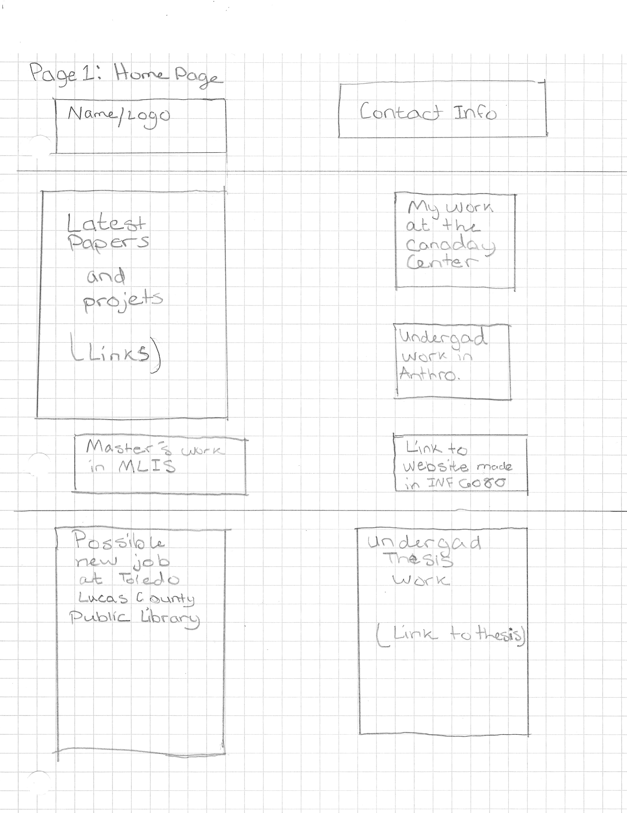

# Sarah "Nicky" Rhymes INF 6420 Project

A portfolio site of my work, including my digital resume and about me page.

## wireframes 

I have attached some wireframes that I have drawn to show how the sites layout could possbily be.

Header-will include my name/logo and contact info

Navigation menu-will include links to work from both my graduate studies, undergaduate studies, my work at the Canaday Center, etc.

Main content- will talk about my work in all of these areas and highlight my skills

Footer-will include copyright information

Header-will include my name/logo and contact info

Navigation menu- will include links on certain parts of the digital resume

Main content-will talk about the different parts of my resume

Footer-will include copyright information

Header-will include my name/logo and contact info

Navigation menu- will images of my art and my personal collections

Main content- will disuss baic info about me, my hobbies, etc

Footer-will include copyrigiht information
